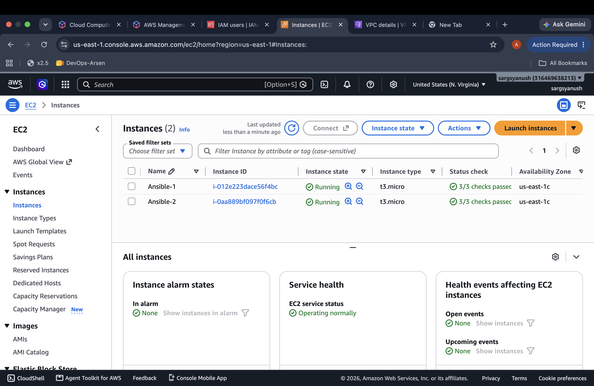
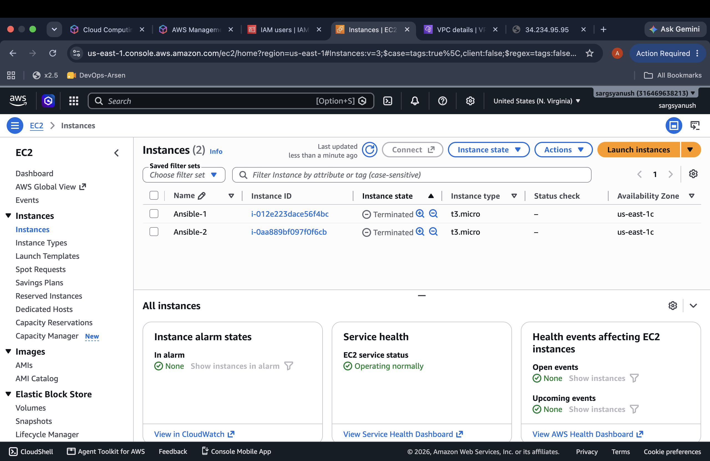
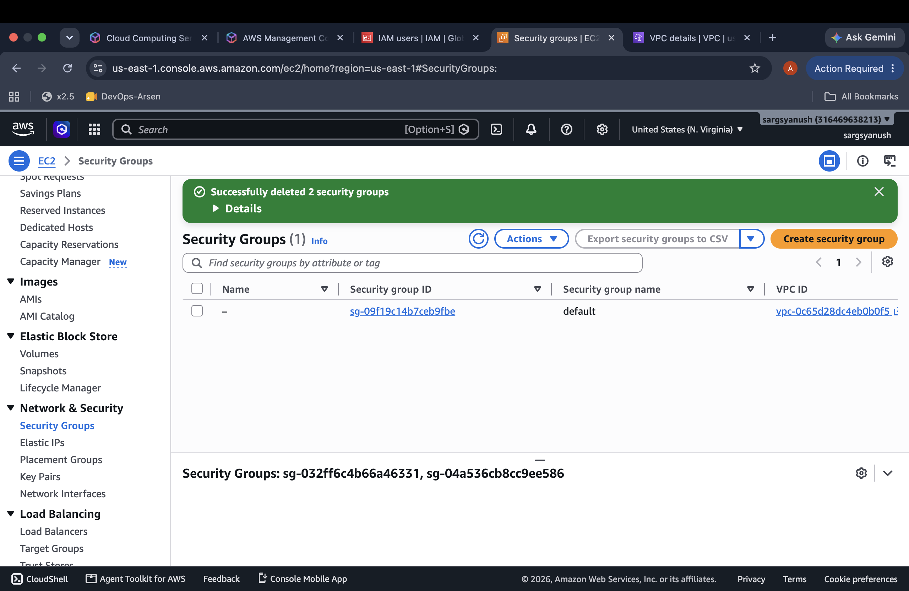
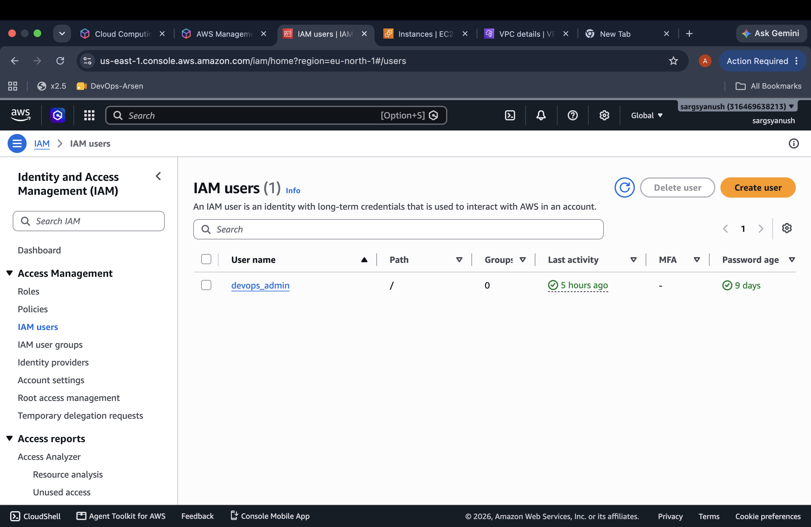
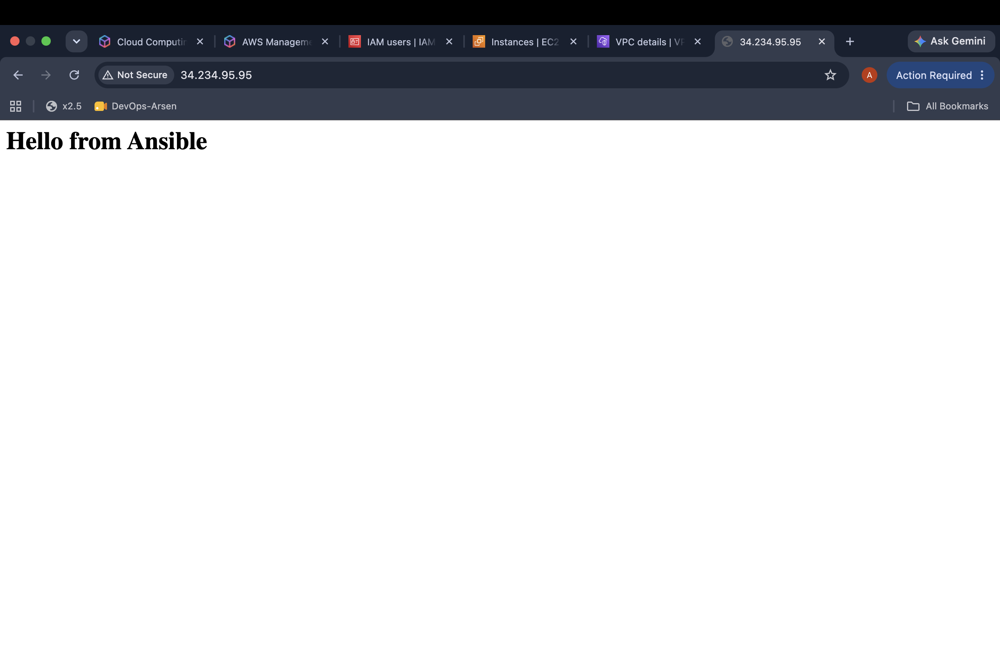

# DevOps Course · Lesson 3: Answers & Documentation

## Part C: Installation & Inventory Setup

### 1. Ansible Version

```bash
config file = /Users/sargsyanushedu/Desktop/ansible/ansible.cfg
ansible python module location = /opt/homebrew/Cellar/ansible/14.4.0/libexec/lib/python3.14/site-packages/ansible
python version = 3.14.7 (main, Aug  5 2026, 10:29:49) [Clang 17.0.0 (clang-1700.6.4.2)] (/opt/homebrew/Cellar/ansible/14.4.0/libexec/bin/python)
```

### 2. Inventory Hosts List

```bash
hosts (2):
  Ansible-1
  Ansible-2
```

### 3. Ping Test

```json
Ansible-1 | SUCCESS => {
    "changed": false,
    "ping": "pong"
}
Ansible-2 | SUCCESS => {
    "changed": false,
    "ping": "pong"
}
```

## Part D: Ad Hoc Commands

### 1. Uptime Command (Implicit Module)

```bash
Ansible-2 | CHANGED | rc=0 >>
 14:20:08 up 1 day,  2:32,  1 user,  load average: 0.04, 0.01, 0.00
Ansible-1 | CHANGED | rc=0 >>
 14:20:08 up 1 day,  2:29,  1 user,  load average: 0.00, 0.00, 0.00
```

### 2. Free Memory (Shell Module with Pipe)

```bash
Ansible-2 | CHANGED | rc=0 >>
Mem:             908         342         236           2         460         565
Ansible-1 | CHANGED | rc=0 >>
Mem:             908         340         252           2         446         568
```

### 3. Setup Module (OS Facts)

```json
Ansible-1 | SUCCESS => {
    "ansible_facts": {
        "ansible_distribution": "Ubuntu",
        "ansible_distribution_file_parsed": true,
        "ansible_distribution_file_path": "/etc/os-release",
        "ansible_distribution_file_variety": "Debian",
        "ansible_distribution_major_version": "26",
        "ansible_distribution_release": "resolute",
        "ansible_distribution_version": "26.04"
    },
    "changed": false
}
Ansible-2 | SUCCESS => {
    "ansible_facts": {
        "ansible_distribution": "Ubuntu",
        "ansible_distribution_file_parsed": true,
        "ansible_distribution_file_path": "/etc/os-release",
        "ansible_distribution_file_variety": "Debian",
        "ansible_distribution_major_version": "26",
        "ansible_distribution_release": "resolute",
        "ansible_distribution_version": "26.04"
    },
    "changed": false
}
```

### 4. Nginx Installation & Idempotency

```bash
# 1st Run (Package installed / Cache updated)
ansible-2 | CHANGED => {
    "cache_update_time": 1789999697,
    "cache_updated": true,
    "changed": true,
    ...
}
ansible-1 | CHANGED => {
    "cache_update_time": 1789999697,
    "cache_updated": true,
    "changed": true,
    ...
}

# 2nd Run (Already installed — Idempotent behavior)
ansible-1 | SUCCESS => {
    "cache_update_time": 1790000671,
    "cache_updated": true,
    "changed": false
}
ansible-2 | SUCCESS => {
    "cache_update_time": 1790000672,
    "cache_updated": true,
    "changed": false
}
```

**Proof of Idempotency:** The `"changed": false` field on the second run proves idempotency, showing that Ansible checked the state and verified Nginx was already present without needing to re-apply changes.

### 5. Service State (Nginx Running and Enabled)

```json
Ansible-1 | SUCCESS => {
    "changed": false,
    "enabled": true,
    "name": "nginx",
    "state": "started",
    ...
}
Ansible-2 | SUCCESS => {
    "changed": false,
    "enabled": true,
    "name": "nginx",
    "state": "started",
    ...
}
```

### 6. Pushing index.html & Verifying via Curl

```json
# Copy Module Output
Ansible-2 | CHANGED => {
    "changed": true,
    "checksum": "0927e5a5e5e8666a3e15dd8e95a8b8f39cf520ab",
    "dest": "/var/www/html/index.html",
    ...
}
Ansible-1 | CHANGED => {
    "changed": true,
    "checksum": "0927e5a5e5e8666a3e15dd8e95a8b8f39cf520ab",
    "dest": "/var/www/html/index.html",
    ...
}
```

```bash
# Curl Verification
Ansible-1 | CHANGED | rc=0 >>
<h1>Hello from Ansible</h1>
Ansible-2 | CHANGED | rc=0 >>
<h1>Hello from Ansible</h1>
```

### 7. Create Deploy User with Sudo Rights

```json
Ansible-2 | CHANGED => {
    "changed": true,
    "create_home": true,
    "groups": "sudo",
    "name": "deploy",
    "shell": "/bin/bash",
    "state": "present"
}
Ansible-1 | CHANGED => {
    "changed": true,
    "create_home": true,
    "groups": "sudo",
    "name": "deploy",
    "shell": "/bin/bash",
    "state": "present"
}
```

### 8. SSH Hardening (lineinfile with --check --diff & Live Run)

```diff
--- before: /etc/ssh/sshd_config (content)
+++ after: /etc/ssh/sshd_config (content)
@@ -143,3 +143,4 @@
 #      AllowTcpForwarding no
 #      PermitTTY no
 #      ForceCommand cvs server
+PermitRootLogin no
```

**Explanation:** `--check --diff` showed a diff preview of how `PermitRootLogin` would change to `no`, without making actual modifications to the server.

```json
# Live Run Output
Ansible-1 | CHANGED => {
    "changed": true,
    "msg": "line added"
}
Ansible-2 | CHANGED => {
    "changed": true,
    "msg": "line added"
}
```

### 9. Targeting a Single Host with --limit

```json
Ansible-1 | SUCCESS => {
    "changed": false,
    "ping": "pong"
}
```

### 10. Non-Existent Group Error vs. UNREACHABLE!

```bash
[WARNING]: Could not match supplied host pattern, ignoring: chlp
[WARNING]: No hosts matched, nothing to do
```

**Explanation:** A non-existent group means Ansible found no matching hosts in the inventory and made no connection attempt, whereas an `UNREACHABLE!` error means the host exists but could not be reached due to network or SSH issues.

## Part E: Teardown & Cloud Costs

**Cost Note:** Even when we stop an instance, we still have to pay for its storage (EBS hard drive). And AWS charges a small fee for any public IP address (Elastic IP) that is not currently being used by an active server, just to make sure people don't waste public IPv4 resources.

## Bonus Section

### 1. Second Inventory Group ([db]) Ping Test

```json
Ansible-1 | SUCCESS => {
    "changed": false,
    "ping": "pong"
}
```

### 2. Why Ansible is "Agentless"

Ansible is called "agentless" because we don't need to install any special background programs or software on our target servers. It simply connects to them securely using standard SSH whenever it needs to do a task.

- This saves time because we never have to install, update, or fix client apps on every single server.
- It saves computer resources (like CPU and memory) since no extra program runs 24/7.
- And it is more secure because fewer running programs mean fewer potential security risks compared to agent-based tools like Puppet or Chef.

### 3. What Forks Control (-f 10)

In Ansible, forks control how many remote hosts are managed in parallel. By default, Ansible uses 5 forks. Increasing this value (e.g., `-f 10`) allows Ansible to communicate with more servers simultaneously, speeding up execution at the cost of higher CPU and memory usage on the control node (our local machine).

## Screenshots

### EC2 Instances





### Security Group



### IAM



### Nginx Verification




