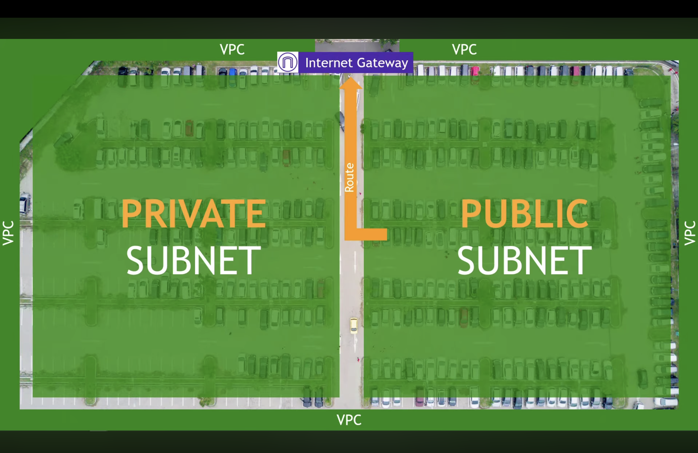
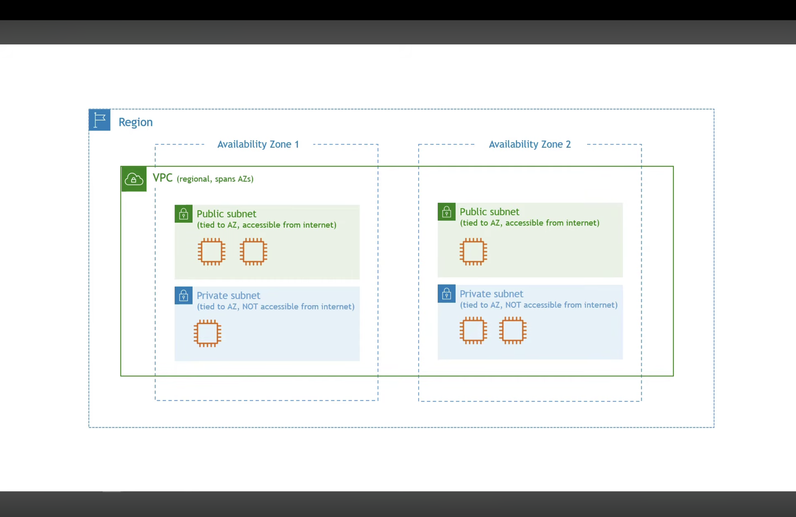
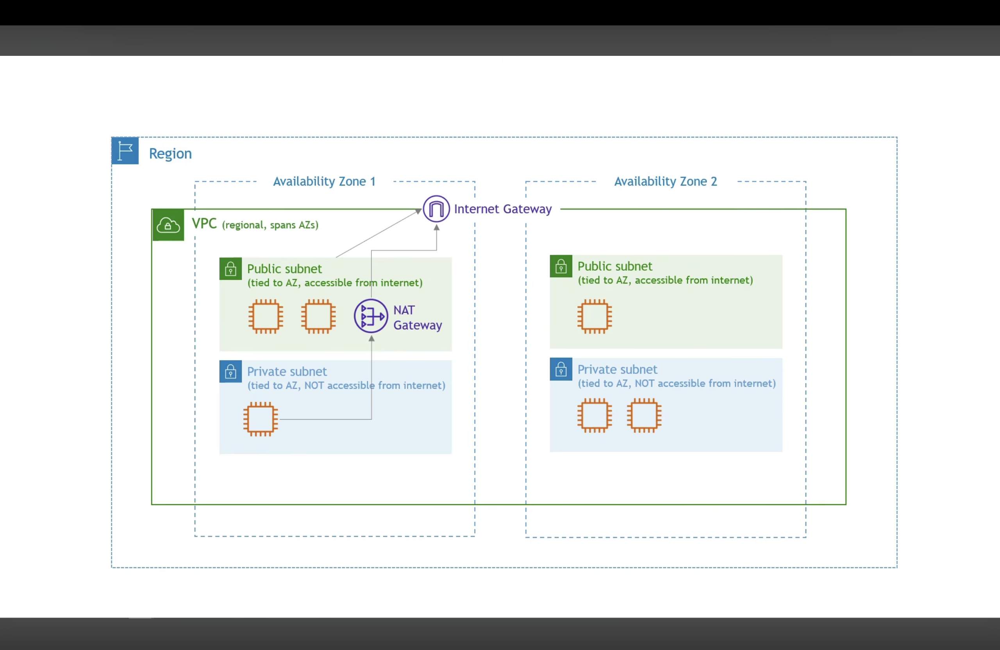
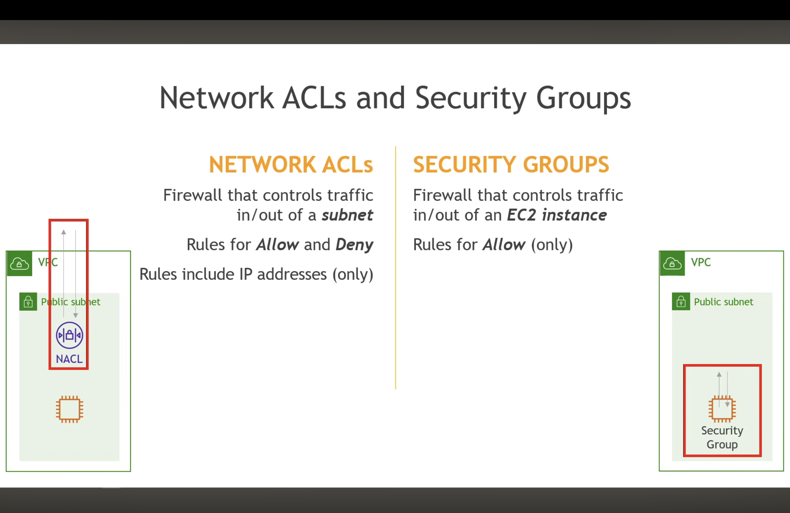

# AWS Networking & Security Fundamentals - Mock Interview Prep

Welcome to your study notes and interactive interview preparation guide for foundational AWS networking and security concepts. This repository tracks our mock interview session covering core infrastructure, high availability, and network security layers.

---

## Table of Contents
1. [Virtual Private Cloud (VPC) & CIDR Blocks](#1-virtual-private-cloud-vpc--cidr-blocks)
2. [Regions & Availability Zones (AZs)](#2-regions--availability-zones-azs)
3. [Security Groups (SG)](#3-security-groups-sg)
4. [Network Access Control Lists (NACLs)](#4-network-access-control-lists-nacls)
5. [Key Differences: Security Groups vs. Network ACLs](#5-key-differences-security-groups-vs-network-acls)
6. [Useful Video Resources & References](#6-useful-video-resources--references)
7. [Hands-On Practice Assignment](#7-hands-on-practice-assignment)

---

## 1. Virtual Private Cloud (VPC) & CIDR Blocks

### Concept Summary
A Virtual Private Cloud acts as your own isolated network environment inside the AWS cloud, completely separating your cloud infrastructure from other customers and the public internet. When you set up a VPC, you define its private IP address range using a CIDR block, which grants you full control over subnets, route tables, and gateways to design your network layout securely.

[cite: 1]

### Mock Interview Questions
1. *What is the primary function of an AWS VPC, and how does it provide network isolation?*
2. *Can two VPCs in different regions or the same region overlap in their CIDR blocks? Why or why not?*
3. *How do you choose an appropriate CIDR block size (e.g., /16 vs /24) when designing a new VPC architecture?*

---

## 2. Regions & Availability Zones (AZs)

### Concept Summary
VPCs operate at a regional level, meaning they span across multiple Availability Zones within a single AWS region but cannot stretch directly across different regions without peering. Availability Zones themselves are physically separate data centers equipped with independent power and networking, allowing applications to achieve high availability by distributing resources so that traffic automatically reroutes if one zone fails.

[cite: 2]  
[cite: 3]

### Mock Interview Questions
1. *Why is it beneficial for a company to deploy resources across multiple Availability Zones?*
2. *If a VPC is regional, how do instances in AZ-A communicate with instances in AZ-B?*
3. *How does multi-AZ deployment differ from multi-region deployment in terms of fault tolerance and latency?*

---

## 3. Security Groups (SG)

### Concept Summary
Security Groups function as stateful, instance-level virtual firewalls that control inbound and outbound traffic for specific resources like EC2 instances. Because they are stateful, any incoming traffic you explicitly permit is automatically allowed to exit back out without needing extra rules, while their default stance blocks all incoming traffic and permits all outgoing traffic.

[cite: 4]

### Mock Interview Questions
1. *What is the default behavior of an AWS Security Group regarding inbound and outbound traffic?*
2. *Explain what "stateful" means in the context of a Security Group.*
3. *Can you write a rule in a Security Group to explicitly deny a specific malicious IP address?*

---

## 4. Network Access Control Lists (NACLs)

### Concept Summary
Network ACLs provide an additional, optional security layer that operates at the subnet level rather than the instance level, acting as a firewall for all traffic entering or leaving a specific subnet. Unlike security groups, NACLs are stateless, meaning you must manually define explicit rules for both incoming and outgoing traffic, and they evaluate rules sequentially based on numerical order rather than checking everything at once.

[cite: 4]

### Mock Interview Questions
1. *What is the function of a Network ACL, and how does its stateless nature differ from a Security Group?*
2. *How are NACL rules evaluated, and why does rule numbering matter?*
3. *When would you choose to use a NACL over a Security Group in a multi-tier application architecture?*

---

## 5. Key Differences: Security Groups vs. Network ACLs

| Feature | Security Group (SG) | Network ACL (NACL) |
| :--- | :--- | :--- |
| **Scope** | Instance level (ENI)[cite: 4] | Subnet level[cite: 4] |
| **Statefulness** | Stateful (remembers return traffic) | Stateless (requires explicit rules for both directions) |
| **Rule Types** | Allow rules only[cite: 4] | Allow and Deny rules[cite: 4] |
| **Evaluation** | Evaluates all rules before deciding | Evaluates rules in numerical order (stops on first match) |

---

## 6. Useful Video Resources & References

Enhance your understanding of these core topics with the following recommended video resources and lecture links:

* [Picsart Lecture Link](https://youtu.be/-fR3C2Irlo8?si=qkhViSbZkDHKzc29)
* [AWS Networking Reference Video 1](https://youtu.be/TUTqYEZZUdc?si=H_6TmAfHicluPnPX)
* [AWS Networking Reference Video 2](https://youtu.be/QM63dyA_4Pc?si=MMusIZVZ6x3Eqefp)
* [AWS Core Concepts Guide](https://www.youtube.com/watch?v=7_NNlnH7sAg)

---

## 7. Hands-On Practice Assignment

To reinforce what you’ve learned today, complete the following hands-on architecture exercise in the AWS Console (or sketch it out on paper/diagramming tool):

### Objective
Design a secure, highly available two-tier web application architecture inside a custom VPC.

### Instructions
1. **Create a VPC**:
   - Create a new VPC with a CIDR block of `10.0.0.0/16`.
2. **Configure Subnets (Multi-AZ)**:
   - Create **two Public Subnets** across two different Availability Zones (e.g., `10.0.1.0/24` in AZ-1a, `10.0.2.0/24` in AZ-1b) for public-facing load balancers or web servers[cite: 2].
   - Create **two Private Subnets** across the same two AZs (`10.0.3.0/24` and `10.0.4.0/24`) for backend databases or application servers[cite: 2].
3. **Set Up Routing & Gateways**:
   - Attach an Internet Gateway (IGW) to your VPC[cite: 3].
   - Configure a Public Route Table associated with your public subnets to route `0.0.0.0/0` traffic to the IGW.
4. **Implement Security Layers**:
   - **Security Group**: Create a Web Server SG that allows inbound HTTP (`80`) and HTTPS (`443`) from anywhere (`0.0.0.0/0`), and verify outbound traffic allows all[cite: 4].
   - **NACL**: Create a custom NACL for your private subnets that explicitly blocks untrusted IP ranges while permitting necessary database traffic ports[cite: 4].
5. **Review & Test**:
   - Validate how your architecture ensures high availability if one AZ goes down, and confirm how your Security Groups and NACLs work together to protect public vs. private tiers[cite: 2, 4].